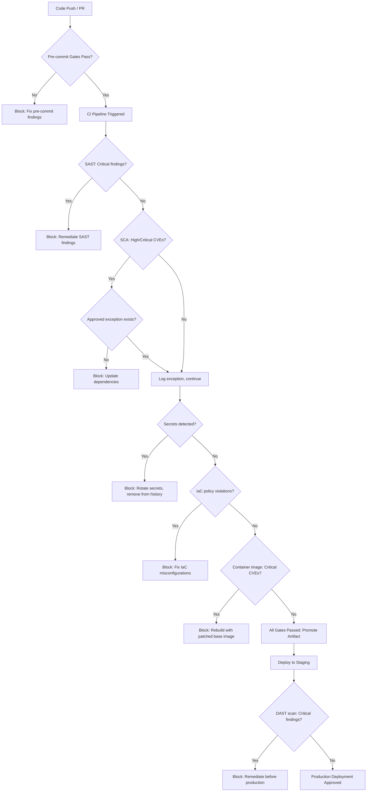

# DevSecOps Reference Architecture

## Table of Contents

- [Architecture Overview](#architecture-overview)
- [The Three Pillars: People, Process, Technology](#the-three-pillars-people-process-technology)
- [Toolchain Layers](#toolchain-layers)
- [Security Gate Placement Across the Pipeline](#security-gate-placement-across-the-pipeline)
- [Integration Architecture with Enterprise Systems](#integration-architecture-with-enterprise-systems)
- [Architecture Diagrams](#architecture-diagrams)

---

## Architecture Overview

The Techstream DevSecOps Reference Architecture describes a layered, defense-in-depth model for integrating security controls into the software delivery lifecycle. It is designed to be platform-agnostic — the architectural patterns apply regardless of whether an organization uses GitHub Actions, GitLab CI, Jenkins, Azure DevOps, or any other CI/CD platform.

The architecture is organized around three foundational pillars — People, Process, and Technology — that must be developed in concert. Technology tools without supporting processes and skilled people are ineffective. Processes without automation are unscalable. People without the right tools and processes cannot sustain security at the speed of modern software delivery.

The architecture defines five pipeline phases across which security controls are applied:

1. **Plan** — Security requirements, threat modeling, risk assessment
2. **Develop** — IDE security plugins, pre-commit hooks, code review
3. **Build** — SAST, SCA, secrets scanning, IaC analysis
4. **Test** — DAST, penetration testing, fuzzing, compliance validation
5. **Deploy and Operate** — Container scanning, runtime security, monitoring, incident response

Each phase has defined security controls, toolchain components, and quality gates that must be satisfied before progression to the next phase.

---

## The Three Pillars: People, Process, Technology

### Pillar 1: People

The people dimension of DevSecOps addresses organizational culture, skills, roles, and responsibilities. Technical tools are ineffective without a workforce that understands how to use them, interprets their output, and is motivated to act on their findings.

#### Organizational Culture

DevSecOps requires a fundamental cultural shift from security as a control function to security as a shared engineering discipline. This shift has several components:

- **Psychological safety** — developers must feel safe reporting security findings and asking security questions without fear of blame
- **Shared ownership** — security outcomes are measured as team-level metrics, not attributed to individuals
- **Learning orientation** — security incidents and near-misses are treated as learning opportunities, not causes for punishment
- **Security as quality** — security defects are treated with the same urgency as functional defects, not as a separate audit concern

#### Security Champions Program

A Security Champions program embeds security knowledge within development teams without requiring every developer to become a security specialist. Each product team has at least one Security Champion who:

- Receives dedicated security training (threat modeling, secure coding, OWASP Top 10)
- Serves as the team's first point of contact for security questions
- Facilitates threat modeling sessions for significant features
- Reviews security findings from automated tools and coordinates remediation
- Participates in cross-functional security champion communities

#### Training and Enablement

DevSecOps organizations invest in continuous security education:

- **Developer security training** — secure coding practices, OWASP awareness, language-specific security patterns
- **Security tooling training** — how to interpret SAST/DAST/SCA findings and distinguish true positives from false positives
- **Incident response training** — tabletop exercises and simulated breaches keep response capabilities current
- **Certification support** — CSSLP, CEH, OSCP, and cloud provider security certifications supported

### Pillar 2: Process

The process dimension defines the workflows, governance structures, and decision frameworks that make security consistent, repeatable, and auditable.

#### Security Requirements Integration

Security requirements are defined alongside functional requirements during sprint planning:
- User stories include acceptance criteria that address relevant security requirements
- STRIDE threat modeling performed for significant architectural changes
- Security user stories created to address identified threats
- Dependency on security tooling outputs before story completion

#### Vulnerability Management Process

A defined vulnerability management process ensures security findings are consistently tracked, prioritized, and resolved:

1. **Discovery** — Automated tools produce security findings continuously
2. **Triage** — Security findings are reviewed, classified by severity, and deduplicated
3. **Prioritization** — Findings are prioritized based on CVSS score, exploitability, and business context
4. **Assignment** — Findings assigned to responsible engineering teams with SLA targets
5. **Remediation** — Engineers remediate findings and provide evidence of fix
6. **Verification** — Automated re-scan confirms remediation; security engineer may verify Critical/High findings
7. **Closure** — Finding closed in vulnerability management system with audit trail

#### SLA Targets by Severity

| Severity | CVSS Range | Remediation SLA |
|---|---|---|
| Critical | 9.0–10.0 | 24 hours |
| High | 7.0–8.9 | 7 days |
| Medium | 4.0–6.9 | 30 days |
| Low | 0.1–3.9 | 90 days |
| Informational | N/A | Next sprint |

#### Change Management and Security Review

Security review is integrated into change management rather than being a separate approval process:
- Pull requests trigger automated security scans; results visible in PR review interface
- Significant architectural changes require a Security Design Review (SDR)
- Security Champions provide first-pass security review for moderate-risk changes
- Security Engineering team provides review for high-risk changes (new authentication, cryptography, payment processing)

### Pillar 3: Technology

The technology pillar covers the automated tools, platforms, and integrations that enable security at scale. The technology layer is organized into the toolchain layers described in the next section.

---

## Toolchain Layers

The DevSecOps toolchain is organized into six layers, each addressing a distinct phase of the security lifecycle.

### Layer 1: Developer Environment Security

Tools and controls that operate in the developer's local environment before code is pushed to the repository.

| Category | Purpose | Example Tools |
|---|---|---|
| IDE Security Plugins | Real-time vulnerability highlighting in the code editor | Snyk IDE Plugin, SonarLint, Semgrep, AWS Toolkit |
| Pre-commit Hooks | Automated checks triggered before each local commit | Husky, pre-commit, Lefthook |
| Secret Detection (Local) | Prevent secrets from entering version control | Gitleaks, detect-secrets, truffleHog |
| Dependency Management | Local dependency vulnerability checks | `npm audit`, `pip-audit`, Dependabot |

**Key controls:**
- Mandatory pre-commit hook enforcement via repository configuration
- IDE plugins configured to use organization's security policy ruleset
- Developer security training on interpreting and acting on tool findings

### Layer 2: Source Code Management (SCM) Security

Controls applied at the source code repository level.

| Category | Purpose | Example Tools / Features |
|---|---|---|
| Branch Protection | Enforce review requirements and prevent force pushes | GitHub Branch Protection, GitLab Protected Branches |
| Commit Signing | Cryptographic verification of commit authorship | GPG, SSH signing keys, Sigstore Gitsign |
| Secret Scanning | Repository-wide scanning for committed secrets | GitHub Secret Scanning, GitLab Secret Detection |
| Dependency Review | Block PRs introducing vulnerable dependencies | GitHub Dependency Review, Mend Renovate |
| CODEOWNERS | Enforce required reviewers for sensitive code paths | GitHub CODEOWNERS |

**Key controls:**
- Require signed commits for all repositories containing production code
- Enable automated security alerts (Dependabot / GitLab Security Advisories)
- Protect the default branch and require at least two reviewers for merge

### Layer 3: Build Security (CI Pipeline)

Security controls executed during the Continuous Integration pipeline.

| Category | Purpose | Example Tools |
|---|---|---|
| SAST | Static code analysis for vulnerability patterns | Semgrep, Checkmarx, Fortify, CodeQL, SonarQube |
| SCA | Dependency vulnerability scanning | Snyk, OWASP Dependency-Check, Mend, Black Duck |
| Secrets Detection | Scan commit history and build artifacts for secrets | Gitleaks, TruffleHog, Semgrep |
| IaC Security Scanning | Analyze Terraform/CloudFormation/Helm for misconfigurations | Checkov, tfsec, KICS, Terrascan |
| Container Image Scanning | Detect OS and package vulnerabilities in container images | Trivy, Grype, Clair, Snyk Container |
| License Compliance | Identify open-source license violations | FOSSA, Snyk, Black Duck |
| SBOM Generation | Generate software bill of materials | Syft, CycloneDX, SPDX tools |

**Key controls:**
- All SAST/SCA/secrets scans run on every pull request
- Critical and High findings block merge (break-the-build policy)
- SBOM artifacts generated and stored per build
- Scan results published to centralized vulnerability management platform

### Layer 4: Artifact and Registry Security

Controls applied to build artifacts and container images after build, before deployment.

| Category | Purpose | Example Tools |
|---|---|---|
| Artifact Signing | Cryptographic signing of artifacts | Cosign, Sigstore, Notary v2 |
| Container Registry Scanning | Policy-based admission scanning | Trivy Operator, Harbor, AWS ECR Scanning |
| Artifact Immutability | Prevent modification of published artifacts | Artifact repository immutable tags |
| Admission Control | Block deployment of unsigned or vulnerable images | Kyverno, OPA Gatekeeper, Connaisseur |

**Key controls:**
- All container images must be signed before promotion to production registry
- Admission controllers prevent deployment of images with Critical CVEs
- Artifact repositories configured with immutable tag policies for production artifacts

### Layer 5: Deployment Security (CD Pipeline)

Security controls applied during the Continuous Delivery/Deployment pipeline.

| Category | Purpose | Example Tools |
|---|---|---|
| DAST | Dynamic security testing against running application | OWASP ZAP, Burp Suite Enterprise, Nuclei |
| Infrastructure Drift Detection | Detect unauthorized changes to infrastructure state | Terraform drift detection, AWS Config, Driftctl |
| Deployment Policy Enforcement | Enforce deployment rules (approvals, environment policies) | OPA, Kyverno, Spinnaker policies |
| Progressive Delivery | Reduce blast radius with canary/blue-green deployments | Argo Rollouts, Flagger, Spinnaker |
| Secrets Injection | Dynamic secret injection at deploy time | HashiCorp Vault, AWS Secrets Manager, Azure Key Vault |

**Key controls:**
- Deployment to production requires manual approval for significant changes
- DAST scans run against staging environment before production promotion
- Secrets injected dynamically at runtime; never stored in container images or pipeline variables

### Layer 6: Runtime Security and Monitoring

Controls operating in production environments after deployment.

| Category | Purpose | Example Tools |
|---|---|---|
| Container Runtime Security | Detect and prevent anomalous container behavior | Falco, Sysdig, Aqua Security |
| Cloud Security Posture Management | Continuous cloud configuration compliance | Wiz, Prisma Cloud, AWS Security Hub |
| SIEM Integration | Centralized security event correlation | Splunk, Elastic SIEM, Microsoft Sentinel |
| Vulnerability Management | Continuous production vulnerability scanning | Qualys, Tenable, Wiz |
| RASP | Runtime application self-protection | Sqreen, Contrast Security |
| Secrets Monitoring | Detect unauthorized secret access | Vault audit logs, cloud KMS audit trails |

---

## Security Gate Placement Across the Pipeline

Security gates are automated pipeline controls that block progression when security thresholds are not met. Gates must be positioned at the optimal point in the pipeline — early enough to provide rapid feedback, but after sufficient analysis to produce accurate results.

```
PLAN          DEVELOP          BUILD                TEST             DEPLOY          OPERATE
  |               |               |                   |                 |                |
  |  Threat    Pre-commit      SAST Gate          DAST Gate        Approval       Runtime
  |  Modeling  Hooks Gate      SCA Gate           Pentest Gate     Gate           Monitoring
  |               |            IaC Gate            Compliance       Signing        Alerts
  |               |            Secrets Gate         Gate            Gate
  |               |            Image Scan Gate
  |               |
  |  [Gate 0]  [Gate 1]        [Gate 2]           [Gate 3]        [Gate 4]       [Gate 5]
```

### Gate 0: Security Requirements (Plan Phase)

- Verify threat model exists and has been reviewed for major features
- Security acceptance criteria present in user stories
- Risk assessment completed for significant architectural changes

**Enforcement:** Manual review; automated checklist enforcement in project management tooling.

### Gate 1: Pre-Commit and PR (Develop Phase)

- No secrets detected in commit
- No known vulnerable dependencies introduced
- Code style and basic security linting pass
- Signed commit required

**Enforcement:** Pre-commit hooks (developer-side); PR required checks (platform-side).

### Gate 2: CI Security Scan (Build Phase)

- No new Critical SAST findings
- No High/Critical CVEs in dependencies without approved exception
- IaC configurations pass policy checks
- No secrets in codebase or build artifacts
- Container base image has no Critical vulnerabilities
- License compliance check passes

**Enforcement:** CI pipeline status checks; merge blocked if any gate fails without approved exception.

### Gate 3: Pre-Production Testing (Test Phase)

- DAST scan completed against staging environment; no Critical/High findings without remediation plan
- Integration tests pass including security-focused test cases
- Compliance checks pass for applicable standards
- Load testing confirms no resource exhaustion vulnerabilities

**Enforcement:** CD pipeline stage gates; deployment to production environment blocked.

### Gate 4: Deployment Controls (Deploy Phase)

- Artifact signature verified
- Admission controller confirms image meets security policy
- Deployment approval obtained (for production)
- Secrets vault references valid and accessible
- Blue/green or canary rollout configured for significant changes

**Enforcement:** Kubernetes admission controllers; CD pipeline approval gates; GitOps PR policies.

### Gate 5: Production Runtime (Operate Phase)

- Runtime security alerts monitored and triaged within SLA
- Production vulnerability scan results reviewed weekly
- Anomaly detection baselines maintained and alerts actioned
- Incident response playbooks current and tested

**Enforcement:** Alerting and on-call rotations; Security Operations Center (SOC) or equivalent.

---

## Integration Architecture with Enterprise Systems

The DevSecOps toolchain does not operate in isolation. It must integrate with existing enterprise systems for identity management, issue tracking, compliance reporting, and monitoring.

### Identity and Access Management (IAM)

```
Enterprise Identity Provider (Okta / Azure AD / LDAP)
         |
         |---> CI/CD Platform (GitHub / GitLab / Jenkins)
         |---> Artifact Registry (JFrog / Nexus / ECR)
         |---> Secrets Manager (Vault / AWS SM)
         |---> Vulnerability Platform (Snyk / Mend)
         |---> Cloud Environments (AWS / Azure / GCP)
```

Key IAM integration requirements:
- SSO/OIDC federation for all DevSecOps tools using corporate identity
- SCIM provisioning for automated user lifecycle management
- Privileged Access Management (PAM) integration for elevated CI/CD access
- OIDC federation between CI/CD platform and cloud providers (eliminates long-lived cloud credentials)

### Vulnerability Management Integration

```
Scan Tools (SAST/DAST/SCA/Container)
         |
         v
Centralized Vulnerability Platform (Snyk / Defect Dojo / Jira Security)
         |
         |---> Jira (ticket creation for findings above threshold)
         |---> SIEM (security finding correlation)
         |---> Risk Register (High/Critical findings → organizational risk)
         |---> Compliance Platform (evidence collection for SOC2/PCI)
```

### SIEM and Monitoring Integration

All DevSecOps toolchain components emit audit and security events to the organization's SIEM:

| Source | Events Forwarded |
|---|---|
| CI/CD Platform | Build triggers, pipeline runs, secret access, permission changes |
| Artifact Registry | Image pushes, pulls, signature failures, policy violations |
| Kubernetes | Admission controller decisions, pod security violations, RBAC changes |
| Secrets Manager | Secret access, rotation events, policy violations |
| SAST/DAST/SCA Tools | Scan completions, new findings, severity changes |

### Ticketing System Integration

Security findings above a configurable threshold automatically create tickets in the organization's issue tracking system (Jira, ServiceNow, Linear):

- Critical findings create P1 tickets with immediate notification
- High findings create P2 tickets assigned to the responsible team
- Medium findings create P3 tickets added to the next sprint backlog
- All tickets include finding details, remediation guidance, and CVSS score

---

## Architecture Diagrams

### DevSecOps Toolchain Pipeline (Mermaid)

```mermaid
graph LR
    subgraph PLAN
        A[Threat Modeling] --> B[Security Stories]
    end

    subgraph DEVELOP
        C[IDE Plugins] --> D[Pre-commit Hooks]
        D --> E[Pull Request]
    end

    subgraph BUILD
        F[SAST Scan] --> G[SCA Scan]
        G --> H[Secrets Scan]
        H --> I[IaC Scan]
        I --> J[Container Scan]
        J --> K[SBOM Generation]
    end

    subgraph TEST
        L[DAST Scan] --> M[Pen Test]
        M --> N[Compliance Check]
    end

    subgraph DEPLOY
        O[Artifact Signing] --> P[Admission Control]
        P --> Q[Secrets Injection]
        Q --> R[Progressive Deploy]
    end

    subgraph OPERATE
        S[Runtime Security] --> T[SIEM Monitoring]
        T --> U[Incident Response]
    end

    B --> C
    E --> F
    K --> L
    N --> O
    R --> S
```



### Three-Zone Security Architecture (ASCII)

```
+------------------------------------------------------------------+
|                        DEVELOPER ZONE                           |
|   +------------+  +---------------+  +---------------------+   |
|   | IDE Plugin |  | Pre-commit    |  | Local SAST/Secret   |   |
|   | (SonarLint)|  | Hooks         |  | Scanning            |   |
|   +------------+  +---------------+  +---------------------+   |
|                           |                                     |
+---------------------------|-------------------------------------+
                            |  Push / PR
+---------------------------|-------------------------------------+
|                    CI/CD PIPELINE ZONE                         |
|   +----------+  +-------+  +-------+  +-------+  +--------+  |
|   | Source   |  | Build |  | SAST  |  | SCA   |  | IaC    |  |
|   | Control  |->| System|->| Gate  |->| Gate  |->| Gate   |  |
|   | (GitHub) |  |       |  |       |  |       |  |        |  |
|   +----------+  +-------+  +-------+  +-------+  +--------+  |
|                                                      |         |
|   +----------+  +-------+  +-------+  +--------+   |         |
|   | Artifact |  | Image |  |Signing|  | DAST   |<--+         |
|   | Registry |<-| Scan  |<-|       |  | Staging|             |
|   |          |  |       |  |       |  |        |             |
|   +----------+  +-------+  +-------+  +--------+             |
|                                                               |
+---------------------------------------------------------------|+
                                                                |
+---------------------------------------------------------------|+
|                    PRODUCTION ZONE                            |
|   +----------+  +---------+  +--------+  +---------------+  |
|   | Admission|  | Runtime |  | Cloud  |  | SIEM /        |  |
|   | Control  |->| Security|->| Posture|->| Monitoring    |  |
|   | (Kyverno)|  | (Falco) |  | Mgmt   |  | (Splunk)      |  |
|   +----------+  +---------+  +--------+  +---------------+  |
+---------------------------------------------------------------+
```

### Security Gate Decision Flow (Mermaid)


